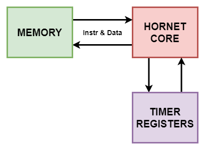

# Barebones SoC
This SoC is developed for simulations. It merely consists of a core, a main memory, and timer registers. as shown in the diagram below,

|Barebones SoC Schematic
|:---:
| |

You can use this SoC to simulate RISC-V binaries. In fact, the test programs in the `test` directory are simulated on this SoC. The memory map is as follows,

|Address Range                  | Peripheral |
|-	|-	|
| 0x0000_0000 0x0000_1DFF 	| ROM |
| 0x0000_1E00 0x0000_1FFF    | RAM |
| 0x0000_2000 0x0000_2007 	| MTIME 	|  	 
| 0x0000_2008 0x0000_200F 	| MTIMECMP 	|

In order to change the memory map, add or remove peripherals; you'll need to modify `barebones_top.v` file accordingly. Also, a simple testbench is provided as an example.